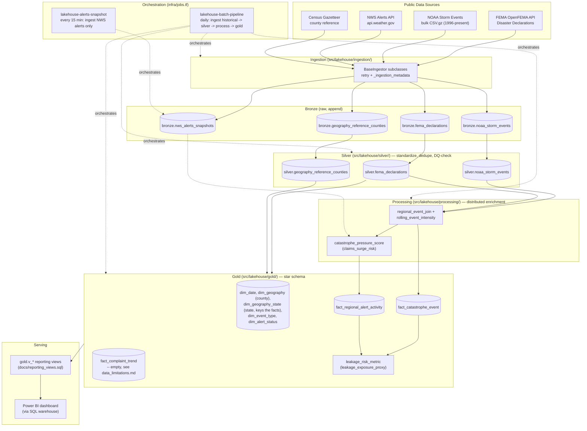

# Architecture

## Layer responsibilities

| Layer | Package | Responsibility |
|---|---|---|
| Ingestion | `src/lakehouse/ingestion/` | Fetch raw source data, attach `_ingestion_metadata` (source date, load time, run id, record count), append to Bronze Delta tables. |
| Silver | `src/lakehouse/silver/` | Normalize schemas/geography (`us_state_codes.py` reconciles FEMA/NOAA's different state-name conventions), dedupe, run data-quality checks, attach `_dq_metadata`. |
| Processing | `src/lakehouse/processing/` | Distributed joins and window-function enrichment (`Window.rangeBetween` for rolling 7d/30d metrics); the layer this project's weakest-pillar focus (Distributed Computing) lives in. |
| Gold | `src/lakehouse/gold/` | Star schema: `dimensions/` and `facts/` sub-packages, plus derived metrics (`leakage_risk_metric`). |
| Orchestration | `src/lakehouse/orchestration/` + `infra/jobs.tf` | Wires stages together (`main.py`'s CLI dispatch), two independently-scheduled Databricks Jobs, structured run logging (`run_logger.py`). |
| Serving | `docs/reporting_views.sql` + Power BI | SQL views Power BI queries directly via a Databricks SQL warehouse (`infra/sql_warehouse.tf`). |

## Why this shape

Every arrow in the diagram is a real, tested function call, not aspirational
architecture — `orchestration/gold_stage.py` and `orchestration/process_stage.py`
literally wire the boxes above together. The one dotted-vs-solid distinction
that matters: `JOB_ALERTS` only ever writes to `bronze.nws_alerts_snapshots`;
it does not trigger Silver/Process/Gold itself (see
[batch_vs_streaming_memo.md](batch_vs_streaming_memo.md) for why).

## Local simulation vs. production

The same code above also runs in a local Docker Compose stack (`Dockerfile`,
`docker-compose.yml`) with no Azure/Databricks dependency for compute or
storage — see [architecture_ideal_vs_actual.md](architecture_ideal_vs_actual.md)'s
"Local validation (Docker Compose)" section for the full story of what was
tried and why. Being equally precise about a simulation's limits matters as
much as being precise about production's real shape:

| | Local simulation (Docker Compose) | Production (Azure) |
|---|---|---|
| Compute | Single-container local Spark session (`local[1]`) | Databricks `SINGLE_USER` cluster (`infra/compute.tf`) |
| Storage | Plain Docker volume, `file://` | ADLS Gen2, `abfss://`, `is_hns_enabled=true`, Unity-Catalog-governed |
| Delta config | Static `docker/spark-defaults.conf` baked into the image | Databricks runtime's ambient Delta/Unity Catalog config |
| Invocation | `docker compose run` against source-mounted code | `python_wheel_task` running a built, uploaded wheel (`infra/jobs.tf`) |
| Upstream APIs | Real FEMA/NOAA/NWS/Census — not emulated | Same, real |
| Orchestration | None — manual invocation only | Two scheduled `databricks_job` resources |

What this does **not** simulate: Unity Catalog governance/permissions, ADLS
Gen2 hierarchical-namespace semantics, cluster autoscaling/autotermination,
job scheduling, and the wheel-based deploy path. Storage emulation
(Azurite) was tried and rejected after direct testing, not skipped for
convenience — see `architecture_ideal_vs_actual.md` for the specifics.
